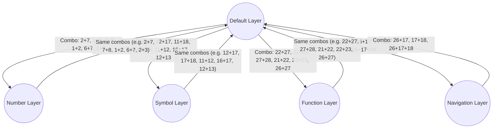

f1 f2 f3 f4 f5    f6 f7 f8 f9 f10
esc q w e r    2 3 i o to0
# Skeletyl ZMK Firmware Configuration

This repository contains the ZMK firmware configuration for the Skeletyl split keyboard. Below is an up-to-date summary of the keyboard's layers, combos, custom behaviors, and configuration.

---

## Keyboard Overview

- **Keyboard Name:** Skeletyl (Breadboard)
- **Type:** Split, wireless/USB, QMK/ZMK-inspired
- **Power:** Bluetooth +8dBm, 30min sleep, deep sleep enabled
- **Features:** Split BLE, USB on both halves, battery reporting, reliable split sync

---

## Layer Summary

### 0: Default Layer
Standard QWERTY typing layer.

### 1: Symbol Layer
Symbols, brackets, and shifted characters.

### 2: Navigation Layer
Text navigation, arrow keys, and editing controls.

### 3: Number Layer
Number row and numeric input.

### 4: Function Layer
F1–F12 and related keys.

### 5: Media Layer
Media controls (play, volume, next/prev, etc).

### 6: Gaming Layer
Optimized for Overwatch and similar games (WASD, quick melee, comms, etc).

---

## Keymap Visual Reference

See `config/key_positions_visual.md` for a full matrix and position reference.

---

## Combo & Layer Logic

---

## Layer Access Summary

---

## Layer Access: Detailed Combo Map

### NUMBER Layer
- **Enter from DEFAULT:**
	- Combos: 2+7, 1+8, 7+8, 1+2, 6+7, 2+3 (all toggle, 15ms)
- **Enter from NUMBER:**
	- Same combos (toggle, 15ms)
- **Exit to DEFAULT:**
	- Same combos (toggle, 15ms)

### SYMBOL Layer
- **Enter from DEFAULT:**
	- Combos: 12+17, 11+18, 17+18, 11+12, 16+17, 12+13 (all toggle, 15ms)
- **Enter from SYMBOL:**
	- Same combos (toggle, 15ms)
- **Exit to DEFAULT:**
	- Combos: 12+13, 16+17 (on SYMBOL, to DEFAULT, 15ms)
	- All entry combos also act as exit (toggle, 15ms)

### FUNCTION Layer
- **Enter from DEFAULT:**
	- Combos: 22+27, 21+28, 27+28, 21+22, 22+23, 26+27 (all toggle, 15ms)
- **Enter from FUNCTION:**
	- Same combos (toggle, 15ms)
- **Exit to DEFAULT:**
	- Combos: 22+23, 26+27 (on FUNCTION, to DEFAULT, 15ms)
	- All entry combos also act as exit (toggle, 15ms)

### NAVIGATION Layer
- **Enter from DEFAULT:**
	- Combos: 26+17, 26+17+18 (to, 30ms)
- **Enter from any other layer:**
	- Combos: 26+17, 26+17+18 (to, 30ms)
- **Exit to DEFAULT:**
	- Combos: 26+17, 26+17+18 (on NAVIGATION, to DEFAULT, 30ms)

**All combos are mirrored for left/right and top/bottom hand positions where possible.**
**Timeouts:** 15ms for most combos, 30ms for navigation combos.

### Sticky Layer Combos (One-Shot)
- **D+K (12+17):** Sticky SYMBOL (from Default)
- **E+I (2+7):** Sticky NUMBER (from Default)
- **C+COMMA (22+27):** Sticky FUNCTION (from Default)

### Shifted/Toggle Combos
- **W+O (1+8), 7+8, 1+2, 6+7:** Toggle NUMBER layer
- **S+L (11+18), 17+18, 11+12, 16+17:** Toggle SYMBOL layer
- **X+DOT (21+28), 27+28, 21+22, 22+23, 26+27:** Toggle FUNCTION layer

#### LED/Side Combos (all 15ms timeout, toggle mode)
- **2+3, 6+7:** Toggle NUMBER layer
- **12+13, 16+17:** Toggle SYMBOL layer
- **22+23, 26+27:** Toggle FUNCTION layer

#### Layer Return Combos
- **On SYMBOL or FUNCTION layers:**
	- **12+13, 16+17:** Instantly return to DEFAULT layer

---

## Navigation Combos (Between Layers)

- **M+K, M+K+L:** Switch to NAVIGATION from any layer except NAVIGATION; same combos on NAVIGATION return to DEFAULT
- **26+17, 26+17+18:** To NAVIGATION (from any non-NAVIGATION layer)
- **26+17, 26+17+18 (on NAVIGATION):** Return to DEFAULT

---

### Other Combos
- **Q+P:** Tilde (~)
- **Z+SLASH:** Lock session (Ctrl+Alt+L)
- **G+H:** Open terminal (Ctrl+Alt+T)
- **A+APOS:** Double Shift
- **B+N:** Toggle Bluetooth/Function layer
- **W+S+D:** Toggle Gaming layer
- **S+D+F:** Go to Gaming layer (Default only)
- **BT_CLR_ALL:** Clear all Bluetooth profiles (Function layer)
- **W+K:** Alt+F4 (Default only)

---

## Custom Behaviors

- **Mod-Tap (`mt`, `mth`, `mtb`):** Tap/hold with tap-preferred, hold-preferred, or balanced logic (200ms tapping term)
- **Sticky Layer (`sl`, `long_sk`):** One-shot or long sticky layer (2s or 15s timeout)
- **Layer-Tap (`lt`):** Tap for key, hold for layer (applied to key positions 2/7 = NUMBER, 12/17 = SYMBOL, 22/27 = FUNCTION, except where transparent)
- **Macros:** Quick actions (open terminal, lock session, double shift, paste git token, Overwatch comms, etc)
- **Layer-Mod Macro (`lm`):** Temporarily switch to a layer while holding a modifier

---

## Configuration Highlights

- Split BLE with central/peripheral roles
- USB enabled on both halves
- Battery reporting
- Aggressive split sync and connection reliability
- Custom Bluetooth name: "Skeletyl" or "Om"

---

## How to Use

1. Refer to the key position visual (`config/key_positions_visual.md`) for matrix mapping
2. Edit `skeletyl.keymap` for layer and key assignments
3. Edit `skeletyl.combos` for combo logic
4. Use the provided macros and behaviors for advanced functionality

---

## Maintainer Notes

---

## Navigation Hierarchy Scheme

The Skeletyl navigation is designed for fast, mirrored, and intuitive layer switching. Combos are mapped so you can both enter and exit layers with the same or adjacent finger positions.

### Visual Layer Navigation Map

#### Combo Mapping Table

| Combo Positions | From Layer | To Layer   | Timeout | Mode   |
|----------------|------------|------------|---------|--------|
| 2+7, 1+8, 7+8, 1+2, 6+7, 2+3 | DEFAULT    | NUMBER     | 15ms    | Toggle |
| 12+17, 11+18, 17+18, 11+12, 16+17, 12+13 | DEFAULT    | SYMBOL     | 15ms    | Toggle |
| 22+27, 21+28, 27+28, 21+22, 22+23, 26+27 | DEFAULT    | FUNCTION   | 15ms    | Toggle |
| 26+17, 17+18, 26+17+18 | DEFAULT    | NAVIGATION | 30ms    | To     |
| 2+7, 7+8, 1+2, 6+7, 2+3 | NUMBER     | DEFAULT     | 15ms    | Toggle |
| 12+17, 17+18, 11+12, 16+17, 12+13 | SYMBOL     | DEFAULT     | 15ms    | Toggle |
| 22+27, 27+28, 21+22, 22+23, 26+27 | FUNCTION   | DEFAULT     | 15ms    | Toggle |
| 26+17, 17+18, 26+17+18 | NAVIGATION | DEFAULT     | 30ms    | To     |

**Mirrored combos**: All combos are available on both left/right and top/bottom sides for fast access.

**Timeouts**: Most combos use 15ms for speed, except navigation combos (30ms).
